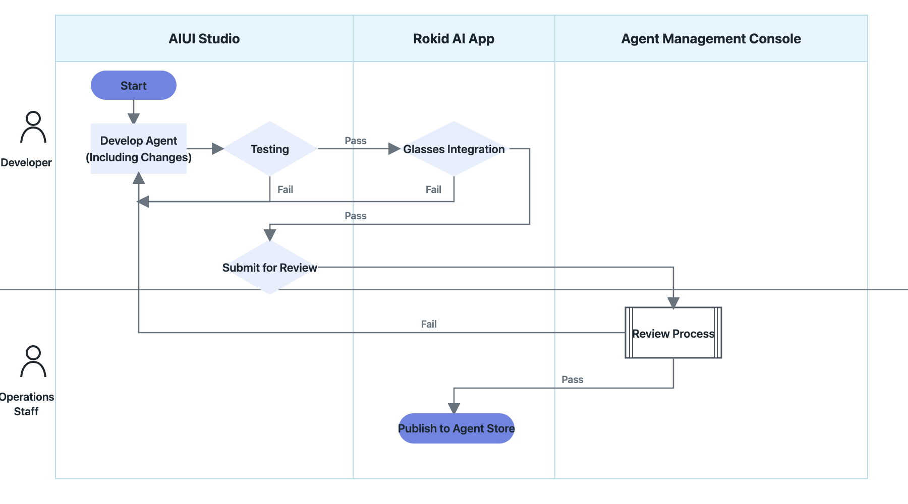

# Submit for Review and Publish to the Hi Rokid Agent Store

After developing your agent, packaging it as an AIX file, and uploading it to the cloud, you can publish it to the Hi Rokid Agent Store through AIUI Studio(Global), where users in Chinese mainland can download and use it.

## AIUI Agent Review and Publishing

## 1. Complete Workflow


```latex
Build project -> Simulate in browser -> Package AIX and upload to cloud -> Debug on a real device -> Complete review information -> Submit for review -> Review result
```

## 2. Complete the Review Information
After completing your self-test, open the **Build & Review** tab and provide the basic information, permission dependencies, and preview materials. Then save the information and submit the agent for review.


| Field | Requirement | Content requirements |
| --- | --- | --- |
| Agent name | Required | No more than 20 characters; must accurately describe the agent's function and must not duplicate another agent's name |
| Icon | Required | Replace the default icon with a custom icon |
| Version number | Generated and incremented automatically | Cannot be edited by developers |
| Agent ID | Generated by the system | Keep it in a safe place |
| Application category | Required | Must match the agent's actual function |
| Feature description | Required | No more than 500 characters; briefly describe the agent's actual capabilities and applicable scenarios |
| Opening message | Required | Keep it within 300 characters when possible; use it to guide users on first entry without repeating the feature description |
| Agent icon | Required | Must be clear, correctly oriented, and relevant to the agent's name and function |
| Permission requests | Select as applicable | Accurately select network, camera, microphone, and speaker permissions and explain the specific purpose of each |
| Permissions for Rokid account information and other personal data | Select as applicable | Required when using personal information such as Rokid account information |
| Preview materials | Required | Upload 3 to 5 files, including at least one image and one video |

## 3. Agent Review Guidelines

### 3.1 Name, Icon, and Copy
+ The opening message must reflect a real use case and clearly tell users what they can do.
+ Do not use terms such as “Official,” “Authoritative,” “Recommended,” “Premium,” or “TOP 1” that imply ranking or endorsement.
+ The name, icon, feature description, and actual capabilities must be consistent. Do not exaggerate, fabricate, or mislead users.
+ The name must not contain terms such as “Test,” “test,” or “beta,” promotional pricing, superlatives, or broad wording that does not identify a specific function.
+ Write the feature description in clear declarative sentences. Do not make absolute claims such as “100% accurate,” “completely error-free,” or “permanently available.”
+ The icon must not be blurry, stretched, inverted, black, or contain unrelated watermarks or QR codes. A solid color or a solid-color background with text cannot be used as the icon.

### 3.2 Permission Dependencies
Before submitting the agent for review, accurately select every permission the agent actually uses and describe the specific purpose of each permission. Reviews follow the principles of minimum necessity and truthful use. Undeclared permission calls, vague purpose descriptions, or inconsistencies between the declared permissions and the code may cause the review to fail.

### 3.3 Preview Materials
Preview materials are used both for platform review and for display in the Agent Store. They must accurately demonstrate the agent's core functions and actual experience.

Images: Show the main interface, typical interactions, or a real glasses view. Do not use black screens, placeholders, text-only watermarks, or screens that show an unreleased version number.

Videos: Demonstrate one or two complete core workflows. Do not show only a launch screen, logo, extended black screen, or unrelated content.

| Material | Specifications |
| --- | --- |
| Image format | JPG or PNG; a 1:1 aspect ratio is recommended |
| Video format | MP4; a 1:1 aspect ratio is recommended |
| Video duration | No more than 60 seconds; 15 to 45 seconds is recommended |
| File size | No more than 50 MB per file is recommended |
| Required media | At least one image and one video |
| Number of files | 3 to 5 files; fewer than 3 or more than 5 does not meet the requirements |

### 3.4 Functionality and Content Safety
+ Apply appropriate safety filters to user-generated content.
+ Label AI-generated and synthetic content as required by applicable laws and regulations.
+ The agent must provide genuine, usable functionality. It must not use excessive marketing, induce users to navigate elsewhere, or harm users' interests.
+ The agent must start, respond, and return normally. It must not frequently crash, exit unexpectedly, become unresponsive, or exhibit obvious functional issues.
+ The agent must not contain illegal transactions, gambling, pornographic or vulgar content, violence or terrorism, drugs, harassment, discrimination, bullying, or other content that violates laws, regulations, or public order and accepted standards of conduct.

AIUI Studio(Global) and review personnel may test functional stability, permission use, consistency of submitted information, and content safety.

## 4. Submit for Review
After confirming that the information and current version are correct, click **Submit for Review**:

+ **Under review**: Wait for the platform review. You can check the status in the agent list.
+ **Review rejected**: Modify the code or information based on the rejection reason, then repackage, save, and resubmit.
+ **Review approved**: The agent enters a publishable state and can be displayed and used in the Rokid Agent Store in the Hi Rokid App.

Before submitting, confirm once more that the core real-device workflows have passed, the permission declarations match the code, the submitted information contains no exaggerated claims, and the number and formats of images and videos meet the requirements.
