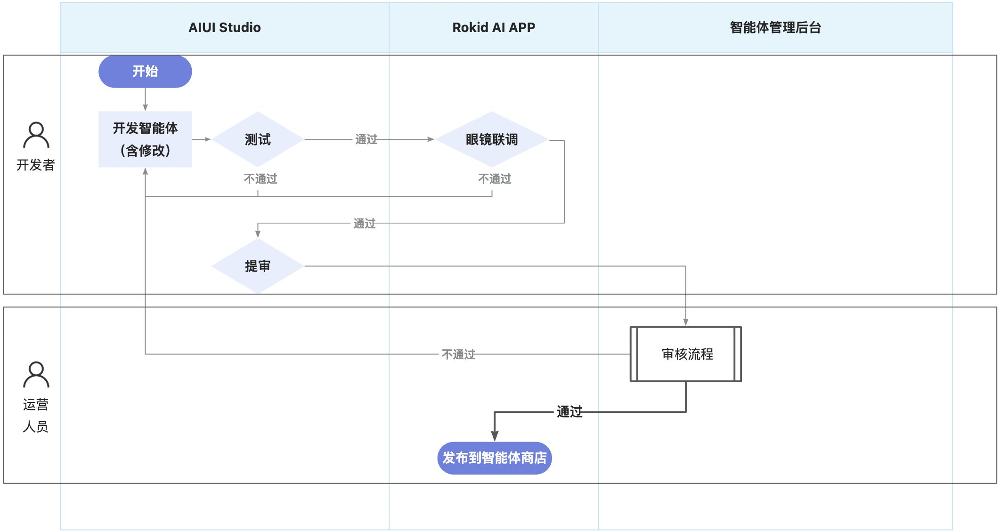
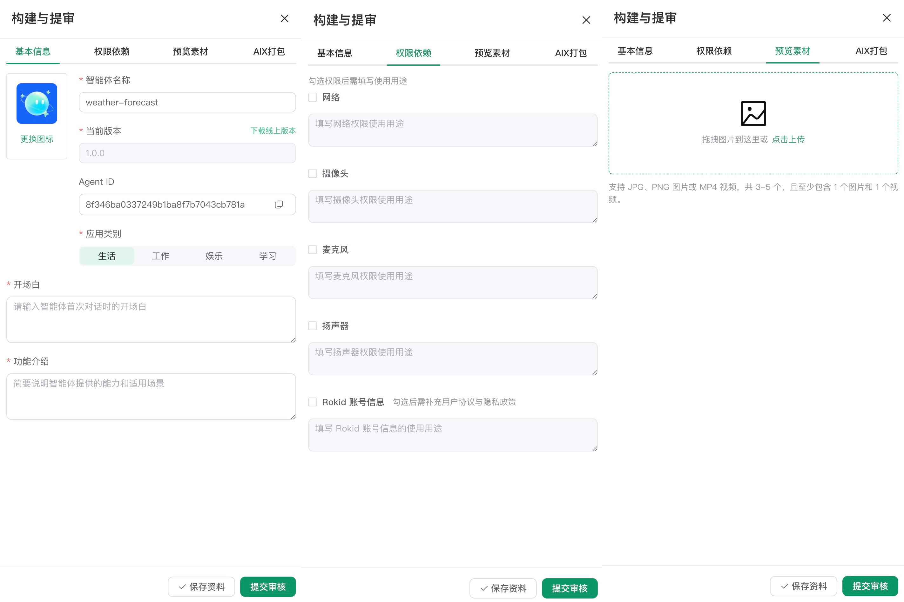

# 提审与发布到 Rokid Ai 智能体商店

在完成智能体的开发与打包 AIX 并上传到云端后，你可以通过 Rokid AIUI Studio 其发布到 Rokid Ai 智能体商店，供中国大陆用户下载和使用。

## AIUI 智能体提审与发布

## 1. 完整流程


```latex
构建项目 → 网页端模拟 → AIX 打包上传云端 → 真机端调试 → 完善提审资料 → 提交审核 → 审核结果
```

## 2. 填写提审资料
完成自测后，在“构建与提审”页签填写基本信息、权限依赖和预览素材，然后保存资料并提交审核。



| 字段 | 填写要求 | 内容要求 |
| --- | --- | --- |
| 智能体名称 | 必填 | 不超过 20 个字符；应准确表达功能，不得与其他智能体重名 |
| 图标 | 必填 | 必须更换图标图标，不可使用默认图标 |
| 版本号 | 系统自动生成和递增 | 开发者无法编辑 |
| Agent ID | 系统生成 | 请妥善保留 |
| 应用类别 | 必选 | 应与智能体实际功能一致 |
| 功能介绍 | 必填 | 不超过 500 个字符；简洁说明真实能力和适用场景 |
| 开场白 | 必填 | 建议控制在 300 字以内；用于首次进入时引导用户，不与功能介绍重复 |
| 智能体图标 | 必填 | 内容清晰、方向正确，并与名称和功能相关 |
| 权限申请 | 依据实际情况勾选 | 如实勾选网络、摄像头、麦克风、扬声器并说明具体用途 |
| Rokid 账号信息等权限 | 依据实际情况勾选 | 使用 Rokid 账号信息等个人信息时必须提供 |
| 预览素材 | 必填 | 上传3～5个文件，且至少包含 1 张图片和 1 个视频 |


## 3. 智能体审核规范

### 3.1 名称、图标与文案
+ 开场白应贴合真实使用场景，明确告诉用户可以做什么。
+ 不得使用“官方”、“权威”、“推荐”、“精品”、“TOP1”等暗示排名或认证的表达。
+ 名称、图标、功能介绍和实际能力必须保持一致，不得夸大、虚构或误导用户。
+ 名称不得包含“测试”、“test”、“beta”、价格促销、极限词或宽泛且无法识别具体功能的词语。
+ 功能介绍使用清晰的陈述句，不得出现“100% 准确”、“绝对无误”、“永久可用”等绝对化承诺。
+ 图标不得模糊、拉伸、颠倒、黑屏、带无关水印或二维码，也不能直接使用纯色或“纯色背景 + 文字”。

### 3.2 权限依赖
提交审核前，必须如实勾选智能体实际使用的全部权限，并为每项权限填写具体用途。审核遵循“最小必要”和“用途真实”原则：未声明却实际调用、用途描述模糊或权限与代码行为不一致，都可能导致审核不通过。

### 3.3 预览素材
预览素材同时用于平台审核和智能体商店展示，应准确呈现核心功能与真实体验。

图片：应展示核心界面、典型交互或真实眼镜视角，不得使用黑屏、占位图、纯文字水印或包含未发布版本号的画面。

视频：应完整演示 1 至 2 个核心流程，不得只展示启动页、Logo、大段黑屏或无关内容。

| 素材项 | 规格要求 |
| --- | --- |
| 图片格式 | JPG、PNG；建议使用 1:1 比例 |
| 视频格式 | MP4；建议使用 1:1 比例 |
| 视频时长 | 不超过 60 秒，建议 15 至 45 秒 |
| 文件大小 | 建议单文件不超过 50 MB |
| 必要组成 | 至少 1 张图片和 1 个视频 |
| 文件数量 | 3～5 个，少于 3 个或多于 5 个均不合规 |


### 3.4 功能与内容安全
+ 对用户生成内容应设置必要的安全过滤机制。
+ 人工智能生成合成内容应按照适用法规添加相应标识。
+ 智能体应提供真实、可用的功能，不得过度营销、诱导跳转或损害用户利益。
+ 智能体必须能够正常启动、交互和返回，不得频繁崩溃、闪退、无响应或出现明显功能异常。
+ 不得包含违法交易、赌博、色情低俗、暴力恐怖、毒品、骚扰、歧视、欺凌或其他违反法律法规及公序良俗的内容。

AIUI Studio 和审核人员可能对功能稳定性、权限使用、资料一致性及内容安全进行测试。

## 4. 提交审核
确认资料和当前版本无误后，点击“提交审核”：

+ **审核中**：等待平台审核，期间可在智能体列表查看状态。
+ **审核拒绝**：根据拒绝原因修改代码或资料，重新打包、保存并提交。
+ **审核通过**：智能体进入可发布状态，并可在 Rokid AI App 的智能体商店中展示和使用。

提交前建议再次确认：真机核心流程已通过、权限声明与代码一致、资料无夸大内容、图片与视频数量和格式符合要求。