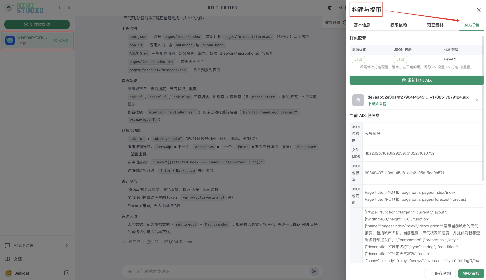

# AIUI 智能体真机调试

真机调试是验证 AIUI 智能体真实体验的关键环节。相比桌面端或模拟环境，真机更能准确反映设备侧的性能表现、交互反馈、网络状态与本地能力调用情况，优先以真机结果作为最终体验判断依据。

## 1. AIX 打包并保存资料
进入右侧“构建与提审”页签，完成打包并保存资料。只有在 AIUI Studio 中生成新版本并保存后，Rokid AI App 的“更新眼镜资源包”才会下载当前智能体的新版本。
版本号由系统自动生成，开发者无法编辑。每次打包、保存资料或提交审核都会使版本号递增。
上传时会显示进度弹窗
+ 上传成功：可继续真机调试或提审
+ 上传失败：根据错误信息修复后重试

对 AIUI 智能体进行打包，构建与提审 -> AIX打包，打包成功后会自动同步到云端



```latex
⚠️ 在进行 AIUI 智能体真机调试前，需要完成“打包 AIX”才可以获取到最新的文件
```

## 2. 真机调试
1. 打开 Rokid AI App，并连接 Rokid Glasses
2. 进入“设置 -> 开发者选项 -> AIUI”
3. 点击“更新眼镜资源包”，等待眼镜端完成下载

4. 看到“智能体资源包下载成功”提示后，通过语义命中智能体，完整体验真实交互链路，例如：“乐奇，打开 xxx 智能体”。

5. 如果效果与预期不符，返回 AIUI Studio 修改、重新打包和保存，再重复以上步骤。

## 3. 开发者自测
完成真机调试后，至少检查以下项目：
- 首屏是否按预期加载，核心任务和返回路径是否正常
- 语音识别、摄像头输入和镜腿操作是否符合预期
- 在不同光照环境下，文字、图标和状态信息是否清晰可辨
- Console、Problems 及网络信息中是否存在未处理的错误
- 在连续操作、异常输入或弱网环境下，应用能否正常恢复

真机运行结果是评估最终体验的主要依据。请重点关注启动耗时、画面稳定性、语音和手势反馈、网络状态、本地能力调用，以及连续运行时的稳定性。
