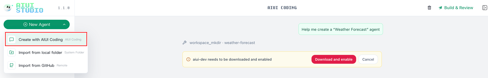
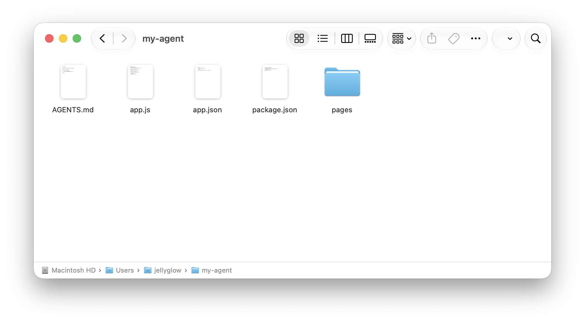
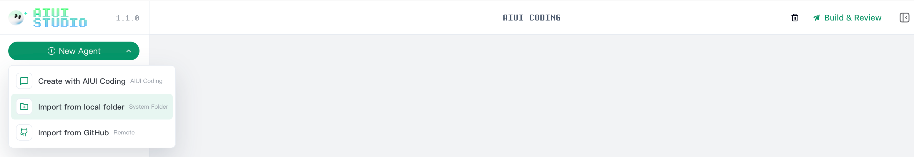
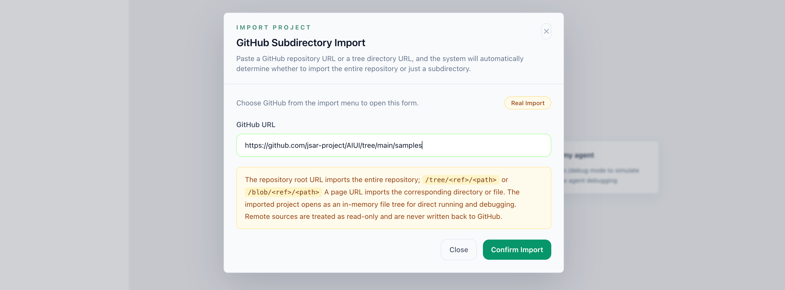
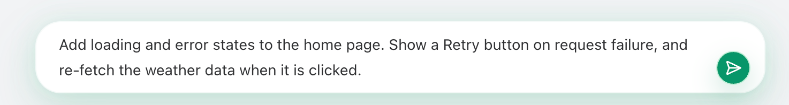
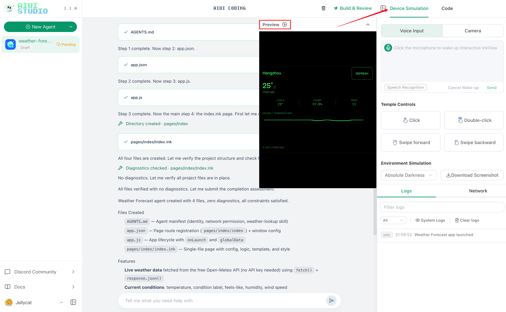
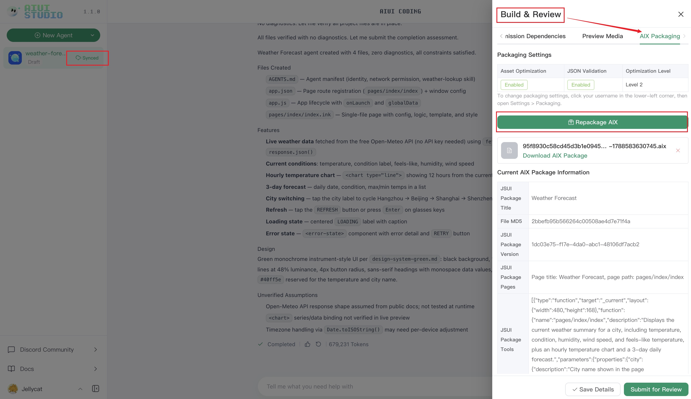
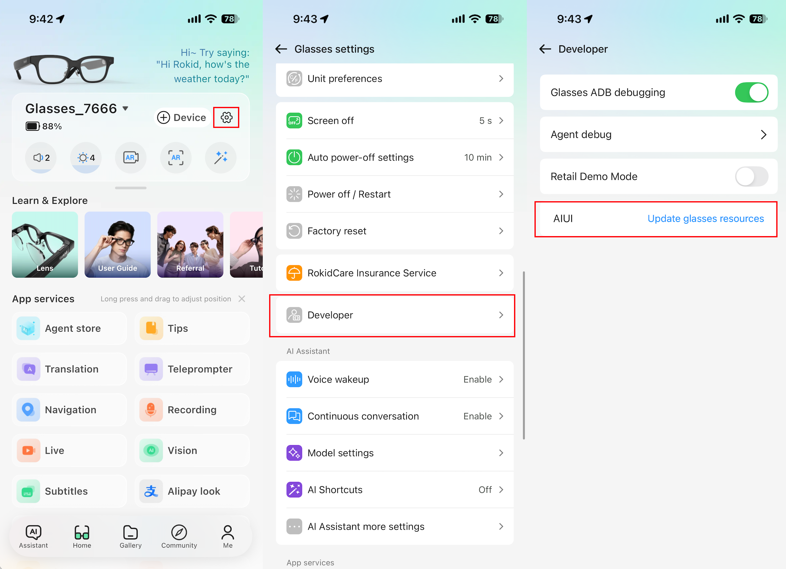
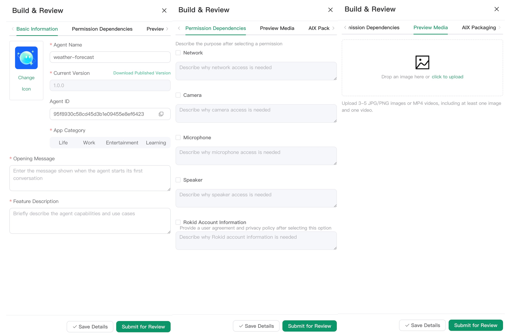

# AIUI QuickStart 
## I. What Is AIUI Studio?
AIUI Studio is Rokid's **one-stop AIUI agent development and build platform** for Rokid Glasses. It runs in a browser, so no local development environment is required. It provides developers with the complete workflow from **creating an AIUI agent** to **submitting it for publication**:

+ Develop with **AIUI CODEING**: describe requirements in natural language, and AI directly reads and writes project code;
+ **Real-device simulation**: simulate how an agent interacts on the glasses, or run the agent directly;
+ **Agent debugging and submission**: complete real-device verification, generate a version, save the required information, and submit it for review.

## II. Sign In to AIUI Studio
1. Open AIUI Studio(Global) in a browser: [https://aiui-global.rokid.com/](https://aiui-global.rokid.com/)
2. If you are not signed in, complete sign-in through the Rokid Account Center.
3. After signing in, you will be returned to the workspace automatically. The agent list on the left will load the cloud-based AIUI agents associated with your account.

## III. Create an AIUI Project in AIUI Studio(Global)
There are three ways to create a new AIUI agent:

| Creation method | Applicable scenario | Result |
| :---: | :---: | :---: |
| Create with Coding | Build an agent from scratch | Enter AIUI CODEING and generate a complete project with natural language |
| Import form local folder | An AIUI project already exists on your computer | Authorize the system folder and import the code |
| Import from Github | The code is in a remote repository | Import the specified directory by repository URL, branch, or tag |

⚠️ Choose only one method to create an AIUI project. Beginners are recommended to use Conversational creation.


## Method 1: Create with Coding
AIUI CODEING is the primary development interface. The first time you use it, download and enable the built-in `aiui-dev` Skill in AIUI Studio.



You can continue to use natural language to add features, adjust the interface, or troubleshoot issues. AI reads the project context and directly modifies project files.

## Method 2: Import form local folder (Create an AIUI Scaffold with npm)
**(1) Enter the following in a device terminal (or command prompt):**

```plain
npm create @yodaos-pkg/aiui-agent@latest my-agent
```

```plain
cd my-agent  # Enter the folder named my-agent
ls           # List files and subfolders in the current folder
```


**(2) Locate the directory containing the files.**



**(3) Click “Local import” and select the corresponding local folder.**



## Method 3: Import from Github
AIUI Sample project: [https://github.com/jsar-project/AIUI/tree/main/samples](https://github.com/jsar-project/AIUI/tree/main/samples)



## IV. Generate and Modify Projects with AIUI CODING
AIUI CODING is AIUI Studio's AI development tool. You can continuously use natural language to add project features, adjust the interface, or troubleshoot issues. The AI CODING tool reads the project context and directly modifies project files.

+ **Command input box**: Enter a requirement and send it; generation can be stopped at any time.


+ **Context attachments**: Attach relevant files to the current instruction to help AI accurately understand the scope of the change.


+ **Instruction suggestions:** Describe one clear objective per instruction, and include the page state, interaction method, and acceptance criteria.



## V. Web Simulation and Debugging in AIUI Studio(Global)
Click the **“Preview”** button in the **“Real-device simulation”** section to debug through a web-based simulation.



**[User input]** Simulates the complete process from wake-up, speech recognition, and the large language model through voice playback.

**[Temple Controls]** Simulates glasses interactions including click, double-click, swipe backward, and swipe forward.

**[Environment Simulation]** Simulates how the AIUI agent appears in different environments.

## VI. Debug an AIUI Agent on a Real Device
In the Hi Rokid app, go to **Settings -> Developer -> Update glasses resource package**.



After you see the message **“Agent resource package downloaded successfully,”** invoke the agent by voice and experience the complete real interaction flow.

For example: “Hi Rokid, open the xxx agent.”



## VII. View and Edit AIUI Agent Code
Open the **“Code”** tab on the right to inspect or manually edit AIUI CODEING. The file tree supports creating, renaming, deleting, copying paths, and refreshing directories.


An AIUI agent's directory structure usually includes global configuration, pages, components, and assets:

```latex
agent-app/
├── AGENTS.md
├── app.json
├── app.js
├── pages/
│   └── index/
│       └── index.ink
└── assets/
```

+ `AGENTS.md`: Describes the agent's identity, responsibilities, and behavioral boundaries.
+ `app.json`: Configures page entry points and global window behavior.
+ `pages/`: Stores pages and interaction logic.
+ `assets/`: Stores static resources such as images and audio.
+ `.ink`: A file format that combines page configuration, logic, structure, and styles in a single file.
+ A project can also use a multi-file page structure composed of WXML, WXSS, JavaScript, and JSON.

For more information about AIUI file and page structures, see [Project structure](https://js.rokid.com/AIUI/guide/structure?version=0.16.1&lang=zh-CN).

## VIII. Publish and Submit for Review in the Hi Rokid Agent Store
In the **“Build &Review”** section, fill in the basic information, permission dependencies, and preview materials. Then save the information and submit it for review.



| Field | Entry requirement | Content requirement |
| --- | --- | --- |
| Agent name | Required | No more than 20 characters; accurately describe the function and must not duplicate another agent's name |
| Icon | Required | Replace the icon; the default icon cannot be used |
| Current Version | Automatically generated and incremented by the system | Cannot be edited by the developer |
| Agent ID | Generated by the system | Keep it securely |
| App Category | Required | Must match the agent's actual function |
| Function description | Required | No more than 500 characters; briefly describe actual capabilities and applicable scenarios |
| Opening message | Required | Recommended to keep within 300 Chinese characters; guide users on first entry and do not duplicate the function description |
| Agent icon | Required | Clear, correctly oriented, and related to the name and function |
| Permission requests | Select based on actual needs | Truthfully select network, camera, microphone, and speaker permissions and explain each purpose |
| Rokid account information | Select based on actual needs | Must provide a description when using Rokid account information or other personal information |
| Preview materials | Required | Upload 3–5 files, including at least 1 image and 1 video |


After confirming that the information and current version are correct, click **“Submit for review.”**

Review statuses:

+ **Under review**: Wait for platform review. You can view the status in the agent list during this period.
+ **Review rejected**: Modify the code or information according to the rejection reason, then repackage, save, and resubmit.
+ **Review approved**: The agent enters a publishable state and can be displayed and used in the agent store in the Rokid AI app.

Before submitting, it is recommended that you confirm once more that the core real-device flow has passed, permission declarations match the code, the information contains no exaggerated claims, and the number and formats of images and videos meet the requirements.
