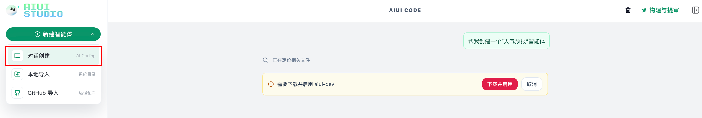
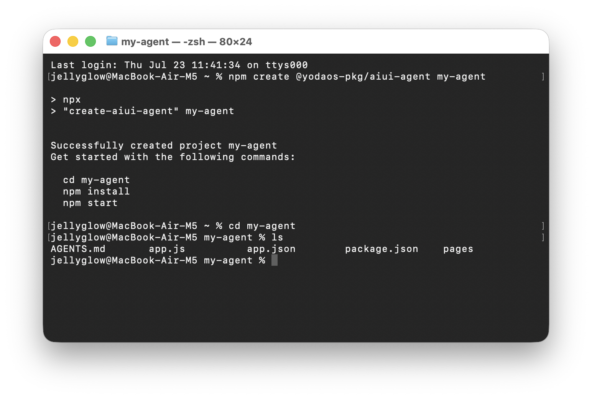
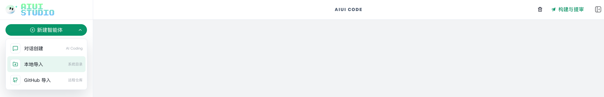
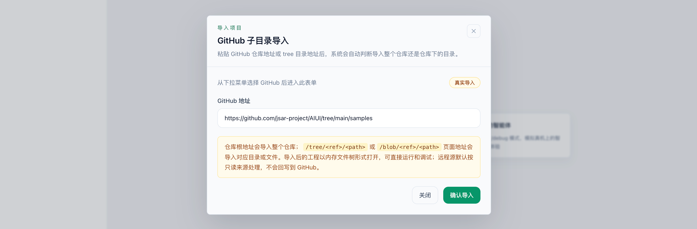
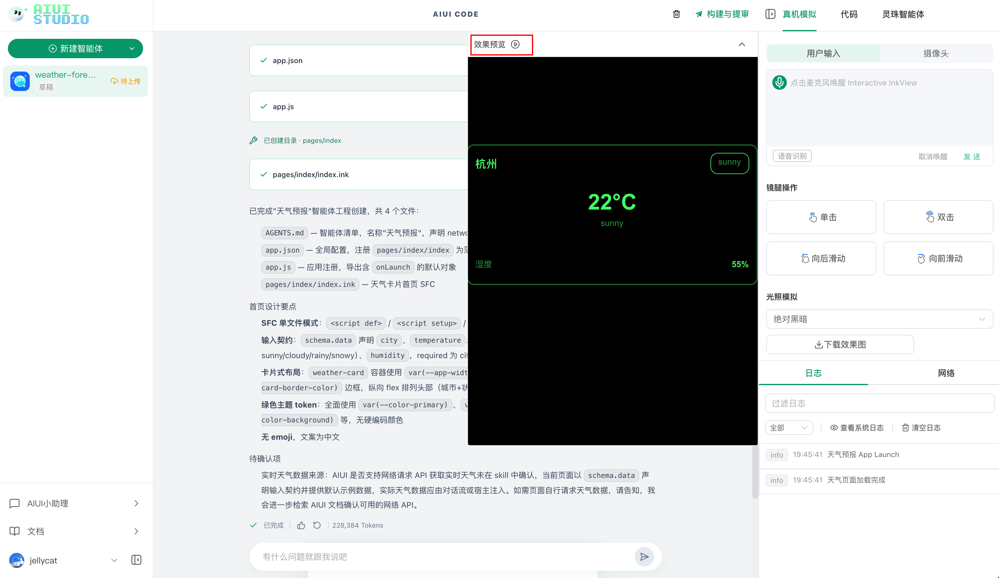
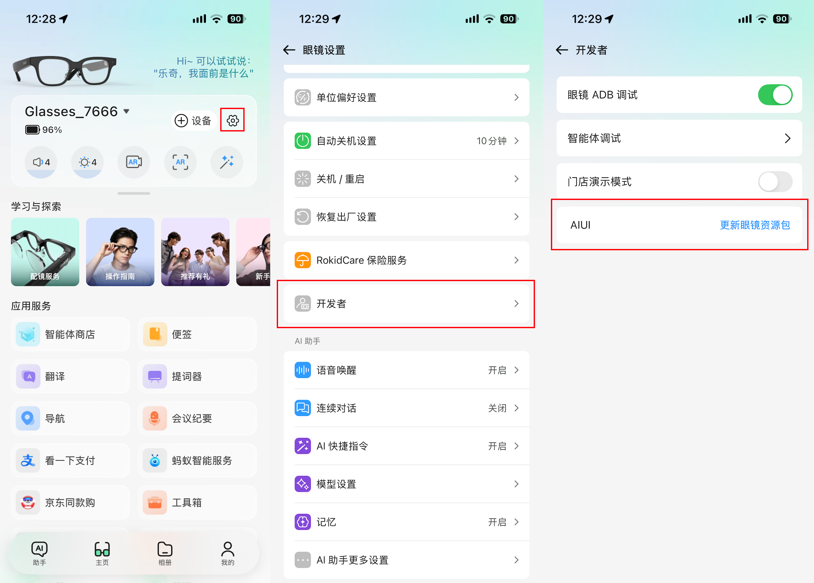
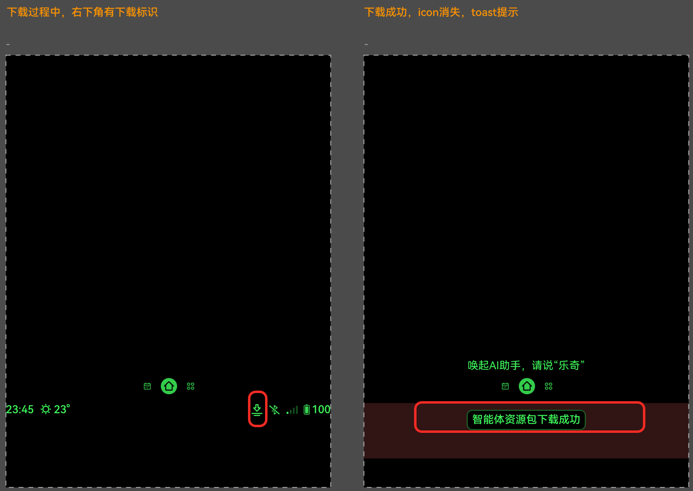
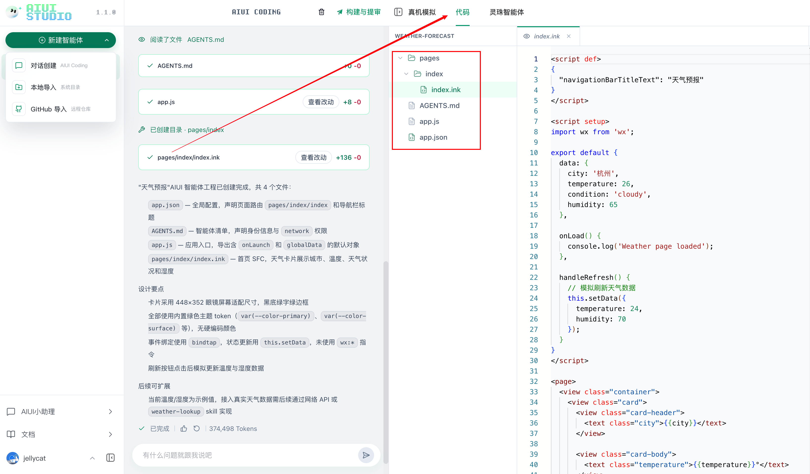

# AIUI 快速入门
## 一、什么是 AIUI Studio

AIUI Studio 是 Rokid 面向 Rokid Glasses 的 AIUI 智能体一站式开发构建平台，运行在浏览器中，无需安装本地开发环境。它为开发者提供从“创建 AIUI 智能体”到“提交上架”的完整链路：

- 用 **AIUI CODEING** 驱动开发：用自然语言描述需求，AI 直接读写项目代码；
- **真机模拟**：模拟智能体在眼镜上的交互流程，也可直接运行智能体；
- **智能体调试与提审**：完成真机验证、版本生成、资料保存和提交审核。

## 二、登陆 AIUI Studio

1. 在浏览器打开 AIUI Studio：<https://aiui.rokid.com/>
2. 若无登录，请在 Rokid 账号中心完成登录。
3. 登录完成后自动返回工作台，左侧智能体列表会加载当前账号下的云端 AIUI 智能体。

## 三、在 AIUI Studio 中创建 AIUI 项目

新建 AIUI 智能体有三种方式：

| 创建方式 | 适用场景 | 结果 |
| --- | --- | --- |
| 对话创建 | 从零开始构建智能体 | 进入 AIUI CODEING，通过自然语言生成完整工程 |
| 本地导入 | 本机已有 AIUI 工程 | 授权系统文件夹后导入代码 |
| GitHub 导入 | 代码位于远程仓库 | 按仓库地址、分支或标签导入指定目录 |

⚠️ 只需选择一种方式进行创建 AIUI 项目，新手推荐使用“对话创建”。

## 方式一：通过 AI Coding 创建

AIUI CODEING 是主要开发界面，初次使用需要下载并启用 AIUI Studio 内置的 `aiui-dev` Skill。



你可以持续用自然语言补充功能、调整界面或排查问题，AI 会读取工程上下文并直接修改项目文件。

## 方式二：本地导入 AIUI 项目

1. 在终端输入：

```plain
npm create @yodaos-pkg/aiui-agent@latest my-agent
```



2. 找到文件所在位置。


3. 点击“本地导入”，选择对应文件夹。



## 方式三：GitHub 导入

AIUI Sample 项目：<https://github.com/jsar-project/AIUI/tree/main/samples>



## 四、使用 AIUI CODING 生成与修改项目

AIUI CODING 是 AIUI Studio 的 AI 开发工具，可以持续用自然语言补充项目功能、调整界面或排查问题，工具会读取工程上下文并直接修改项目文件。

- **命令输入框**：输入需求后发送，生成过程中可随时停止。


- **上下文附件**：将相关文件附加到当前指令，帮助 AI 精确理解修改范围。


- **指令建议**：一次指令只描述一个清晰目标，并补充页面状态、交互方式和验收结果。


## 五、AIUI Studio 网页端模拟调试

点击“真机模拟”栏的“效果预览”按钮，可直接在 Web 端进行模拟调试。可模拟用户输入、镜腿操作和不同光照环境。



## 六、AIUI 智能体真机调试

在 Rokid Ai APP 中进入“设置——开发者”，更新眼镜资源包。



看到“智能体资源包下载成功”提示后，通过语义命中智能体，体验真实交互链路，例如：“乐奇，打开 xxx 智能体”。



## 七、查看和编辑 AIUI 智能体代码

打开右侧“代码”页签即可检查或手动编辑 AIUI 代码，文件树支持新建、重命名、删除、复制路径和刷新目录。



项目目录通常包含全局配置、页面、组件和资源：

```text
agent-app/
├── AGENTS.md
├── app.json
├── app.js
├── pages/
│   └── index/
│       └── index.ink
└── assets/
```
+ `AGENTS.md`：描述智能体身份、职责和行为边界。
+ `app.json`：配置页面入口和全局窗口行为。
+ `pages/`：存放页面及交互逻辑。
+ `assets/`：存放图片、音频等静态资源。
+ `.ink`：该文件格式可在单个文件中组合页面配置、逻辑、结构和样式；
+ 项目也可以采用 WXML、WXSS、JavaScript 和 JSON 组成的多文件页面结构

了解更多 AIUI 文件页面结构请查看[项目结构](../structure.md)

## 八、发布提审上架到 Rokid Ai 智能体商店

在“构建与提审”栏中填写基本信息、权限依赖和预览素材，然后保存资料并提交审核。


| 字段 | 填写要求 | 内容要求 |
| --- | --- | --- |
| 智能体名称 | 必填 | 不超过 20 个字符；应准确表达功能，不得与其他智能体重名 |
| 图标 | 必填 | 必须更换图标图标，不可使用默认图标 |
| 版本号 | 系统自动生成和递增 | 开发者无法编辑 |
| Agent ID | 系统生成 | 请妥善保留 |
| 应用类别 | 必选 | 应与智能体实际功能一致 |
| 功能介绍 | 必填 | 不超过 500 个字符；简洁说明真实能力和适用场景 |
| 开场白 | 必填 | 建议控制在 300 字以内；用于首次进入时引导用户，不与功能介绍重复 |
| 智能体图标 | 必填 | 内容清晰、方向正确，并与名称和功能相关 |
| 权限申请 | 依据实际情况勾选 | 如实勾选网络、摄像头、麦克风、扬声器并说明具体用途 |
| Rokid 账号信息等权限 | 依据实际情况勾选 | 使用 Rokid 账号信息等个人信息时必须提供 |
| 预览素材 | 必填 | 上传3～5个文件，且至少包含 1 张图片和 1 个视频 |


确认资料和当前版本无误后，点击“提交审核”

审核状态：

+ **审核中**：等待平台审核，期间可在智能体列表查看状态。
+ **审核拒绝**：根据拒绝原因修改代码或资料，重新打包、保存并提交。
+ **审核通过**：智能体进入可发布状态，并可在 Rokid AI App 的智能体商店中展示和使用。

提交前建议再次确认，真机核心流程已通过、权限声明与代码一致、资料无夸大内容、图片与视频数量和格式符合要求。
