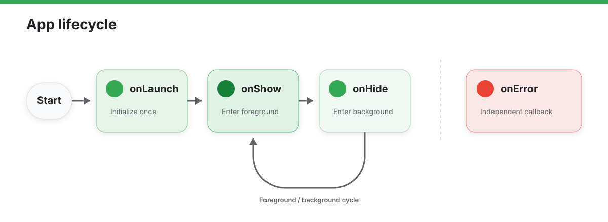

# App

`App` is used to register an agent application.

## Define the App Lifecycle

```javascript
export default {
  onLaunch(options) {
    // 智能体初始化
  },
  onShow(options) {
    // 智能体显示
  },
  onHide() {
    // 智能体隐藏
  },
  globalData: {
    // 全局数据
  }
}
```

## Send a Message to the Host

The App instance can send structured data to the embedding AIUI host with `postMessage()`:

```javascript
export default {
  onLaunch() {
    this.postMessage(
      { type: 'app.ready' },
      { origin: 'aiui-agent', lastEventId: 'launch-1' },
    );
  },
};
```

## API Reference

### `getApp()`

Returns the current `App` instance so pages or components can access app-level state and methods.

### `app.postMessage(data, options?)`

Sends a JSON-compatible structured message to the host.

| Parameter | Type | Required | Description |
| --- | --- | --- | --- |
| `data` | `any` | Yes | JSON-compatible data to send. |
| `options.origin` | `string` | No | Sender identifier. Defaults to `'ink-js'`. |
| `options.lastEventId` | `string` | No | Correlation identifier forwarded with the message. |

### Lifecycle Callbacks

The App lifecycle describes state changes for the entire agent application, from initialization through foreground entry and exit. Declare lifecycle callbacks on the object exported by `app.js`; each callback runs with the current App instance as `this`.



`onLaunch()` runs only once during initialization. The App can then move between foreground and background repeatedly through `onShow()` and `onHide()`. `onError()` is an independent error path rather than a foreground-state transition.

| Callback | Description | Trigger Timing |
| :--- | :--- | :--- |
| `onLaunch` | Listens for agent initialization | When agent initialization completes, only once globally |
| `onShow` | Listens for the agent being shown | When the agent starts, or returns from background to foreground |
| `onHide` | Listens for the agent being hidden | When the agent moves from foreground to background |
| `onError` | Error listener function | When a script error occurs in the agent, or when an API call fails |

#### `onLaunch(Object options)`

Runs once after the App finishes initializing. `options` contains the launch context. Use this callback to initialize `globalData`, restore persistent state, or establish app-level resources. Do not use it for work that depends on a page completing its initial render.

#### `onShow(Object options)`

Runs when the App is first shown and whenever it returns from the background. `options` contains the current show context. Use it to refresh app-level visibility state, resume paused work, or check whether data needs to be synchronized again.

#### `onHide()`

Runs when the App moves from the foreground to the background. Use it to pause foreground-only work, save temporary state, or release resources that do not need to remain active in the background. Moving to the background does not cause `onLaunch()` to run again.

#### `onError(String msg)`

Runs when the runtime reports an unhandled script error or API-call error. `msg` is the error message and can be recorded for diagnostics; this callback does not replace error handling provided by individual asynchronous APIs.

### Event Callbacks

Host input events are delivered to the active Page or Widget first. They continue to the App only when propagation has not been stopped.

| Callback | Description | Trigger Timing |
| :--- | :--- | :--- |
| `onKeyDown` | Listens for app-level key-down events | When the user presses a key and the active page or Widget has not stopped propagation |
| `onKeyUp` | Listens for app-level key-up events | When the user releases a key and the active page or Widget has not stopped propagation |
| `onVoiceWakeup` | Listens for app-level voice-wakeup events | When voice wakeup is matched and the active page or Widget has not stopped propagation |

#### `onKeyDown(KeyboardEvent event)`

Runs when the user presses a key. `event.code` identifies the key. The App receives this event after the active Page or Widget, so use it for app-wide shortcuts whose propagation was not stopped by the active entry surface.

#### `onKeyUp(KeyboardEvent event)`

Runs when the user releases a key. `event.code` identifies the key. Some keys have default behavior such as navigating back, scrolling, or activating a target after event dispatch; call `event.preventDefault()` to prevent that behavior.

#### `onVoiceWakeup(VoiceWakeupEvent event)`

Runs after the host detects voice wakeup. `event.keyword` contains the matched wake word. This event also passes through the active Page or Widget first, so use the App callback for voice-wakeup handling shared across pages.
