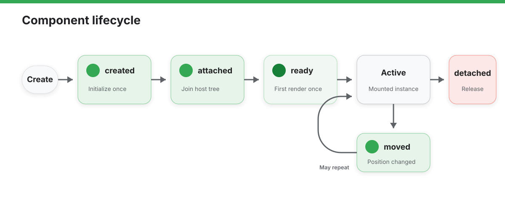

# Component

`Component` represents the runtime instance object exposed by an AIUI custom component.

When you access `this` inside component `methods`, `lifetimes`, or event handlers, you are working with the `Component` capability surface.

## Define and Use a Component

```javascript
export default {
  data: {
    count: 0
  },
  properties: {
    title: {
      type: String,
      value: 'Untitled'
    }
  },
  methods: {
    increment() {
      const nextCount = this.data.count + 1;

      this.setData({
        count: nextCount
      });

      this.triggerEvent('change', {
        value: nextCount
      });
    }
  }
}
```

## `this` in Lifecycles

Component lifecycle callbacks also run with the current component instance as `this`.

Common lifecycle callbacks currently include:

- `created`
- `attached`
- `ready`
- `moved`
- `detached`

```javascript
export default {
  lifetimes: {
    ready() {
      console.log(this.data);
    }
  }
}
```

## Inspect Named Slots

The runtime exposes a snapshot of host-provided named slots through `this.$slots`. Use `hasSlot()` to check whether a slot contains content:

```javascript
export default {
  lifetimes: {
    ready() {
      if (this.hasSlot('actions')) {
        console.log(this.$slots.actions);
      }
    },
  },
};
```

## API Reference

### Instance Members

| Member | Type | Description |
| :--- | :--- | :--- |
| `this.data` | `Object` | The local state object of the current component |
| `this.properties` | `Object` | The resolved input properties of the current component |
| `this.setData(data, callback?)` | `Function` | Updates component state and triggers a view refresh |
| `this.triggerEvent(name, detail?)` | `Function` | Dispatches a custom event to the parent |
| `this.$slots` | `Readonly<Record<string, readonly ComponentSlotEntry[]>>` | Snapshot of host-provided named slots |
| `this.hasSlot(name)` | `Function` | Reports whether a named slot contains content |

Methods declared in `methods` are attached directly to the component instance and run with the current component instance as `this`.

### Lifecycle Callbacks

The component lifecycle describes how one component instance is created, attached, initially rendered, moved, and detached. Declare these callbacks under `lifetimes`; every callback runs with the current component instance as `this`.



`created()`, `attached()`, and `ready()` form the main path into the host tree. `moved()` can run multiple times while the component remains attached. `detached()` runs when the component leaves the host tree and ends the lifecycle of that instance.

| Callback | Description | Trigger Timing |
| :--- | :--- | :--- |
| `created` | Listens for component creation | After the component instance and its initial state are created |
| `attached` | Listens for component attachment | After the component is attached to its host tree |
| `ready` | Listens for initial render completion | After the component subtree completes its initial render |
| `moved` | Listens for component node movement | When the component changes position in its host tree |
| `detached` | Listens for component detachment | When the component is removed from its host tree |

#### `lifetimes.created()`

Runs after the component instance and its initial `data` and `properties` are created. Use it to initialize local state that does not depend on attachment or rendering. Do not perform work that requires the host tree or completed initial render here.

#### `lifetimes.attached()`

Runs after the component is attached to its host tree. Use it to register host-node-related listeners or start work that should remain active while the component is attached.

#### `lifetimes.ready()`

Runs after the component subtree completes its initial render. Use it for initialization that depends on the component view being ready. Later state updates do not trigger this callback again.

#### `lifetimes.moved()`

Runs when the component changes position in its host tree. Use it only when the component needs to respond to reordering or a parent relationship change.

#### `lifetimes.detached()`

Runs when the component is removed from its host tree. Use it to stop timers, cancel unfinished work, unregister listeners, and release resources owned by this component instance.

### Node Event Handlers

Components do not automatically receive the host-level callbacks delivered to a Page or App. To handle keys, bind events on a template node and declare the handlers under `methods`.

| Handler | Corresponding Binding | Description |
| :--- | :--- | :--- |
| `onKeyDown(event)` | `bindkeydown="onKeyDown"` | Handles a key-down event on the current component node |
| `onKeyUp(event)` | `bindkeyup="onKeyUp"` | Handles a key-up event on the current component node |

#### `methods.onKeyDown(KeyboardEvent event)`

Runs when a component node with `bindkeydown="onKeyDown"` receives a key-down event. `event.code` identifies the key. `this` is the current component instance, so the handler can call `this.setData()` directly to update component state.

#### `methods.onKeyUp(KeyboardEvent event)`

Runs when a component node with `bindkeyup="onKeyUp"` receives a key-up event. `event.code` identifies the key; call `event.preventDefault()` when the key has default behavior that the component needs to prevent. Defining a method with this name does not subscribe the component automatically—the template binding is required.

### `this.data`

`data` stores the component's own mutable state.

- If the component definition does not explicitly declare `data`, the runtime initializes it as an empty object
- After `setData()` runs, `this.data` reflects the latest state
- Path-style updates are supported, such as `'profile.name': 'AIUI'`

### `this.properties`

`properties` stores the current input property values of the component.

- Property declarations are defined in the `properties` option
- The runtime merges default values with values passed from the parent
- `this.properties` reflects the effective values currently in use

```javascript
export default {
  properties: {
    title: {
      type: String,
      value: 'Untitled'
    }
  },
  lifetimes: {
    created() {
      console.log(this.properties.title);
    }
  }
}
```

### `this.$slots` and `this.hasSlot(name)`

Each item in `this.$slots[name]` contains these fields:

| Field | Type | Description |
| --- | --- | --- |
| `tagName` | `string` | Resolved concrete tag name. |
| `attributes` | `Record<string, string>` | Rendered attributes from the source node. |
| `textContent` | `string` | Optional text content. |
| `sourceComponentId` | `string` | Optional source custom-component identifier. |

`this.hasSlot(name)` returns a `boolean` indicating whether the host provided content for that named slot.

### `this.setData(Object data, Function? callback)`

`setData()` merges a data patch from the logic layer into the current component state.

- `data` must be an object
- Top-level keys are written directly into `data`
- Dot-path keys create intermediate objects when needed
- `callback` runs after the update completes

```javascript
export default {
  data: {
    profile: {
      name: 'AIUI'
    }
  },
  methods: {
    updateProfile() {
      this.setData({
        'profile.name': 'AIUI Agent'
      }, () => {
        console.log('component state updated');
      });
    }
  }
}
```

### `this.triggerEvent(String name, Object? detail)`

`triggerEvent()` dispatches a custom event from the current component to its parent.

- `name` is the event name
- `detail` is the optional event payload
- Parent pages or parent components can listen through `bind<event>`

```javascript
export default {
  methods: {
    handleSelect() {
      this.triggerEvent('select', {
        id: this.properties.itemId
      });
    }
  }
}
```
