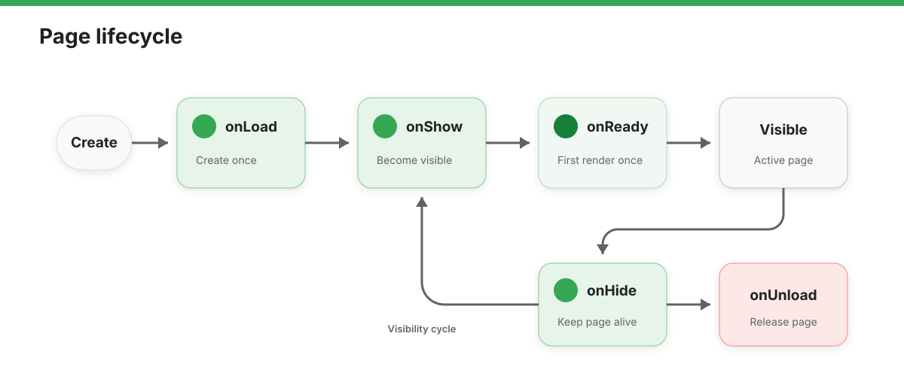

# Page

`Page` is used to register a page in an agent. The logic for each page is exported as a configuration object through `export default`.

At runtime, enumerable properties from the default export are mounted onto the page instance, and the framework also injects built-in page capabilities such as `data`, `setData()`, `postMessage()`, `querySelector()`, and world-awareness APIs.

`Page` also inherits event-target behavior, so standard event methods such as `addEventListener()`, `removeEventListener()`, and `dispatchEvent()` are available.

## Define a Page and Update State

```javascript
export default {
  data: {
    text: "This is page data.",
    user: {
      name: 'Rokid'
    }
  },
  onLoad(options) {
    // Page load
    const title = this.querySelector('.title');
    console.log(title?.tagName);
  },
  handleUpdate() {
    // Update data
    this.setData({
      text: 'Updated Text',
      'user.name': 'New Name' // Path-style update
    }, () => {
      console.log('Data updated');
    });
  },
  handleNotifyHost() {
    this.postMessage({
      type: 'page.ready',
      payload: {
        text: this.data.text
      }
    });
  },
  handleComplete() {
    // Complete the current page task
    this.finish();
  },
}
```


## API Reference

### Instance Properties and Methods

In page logic, you can access the page instance through `this` and use the following properties and methods.

#### `this.data`

`data` is the current state object of the page.

- If the default export provides `data`, the runtime uses it as the current page state
- If `data` is omitted, the runtime initializes it to an empty object `{}`
- Assigning a new object to `this.data` replaces the currently stored state object

#### `this.setData(Object data, Function? callback)`

Used to send data from the logic layer to the view layer asynchronously, while also updating the corresponding values in `this.data`.

- **Parameters**:
  - `data`: Key-value pairs containing the data to update. Path-style updates are supported, for example `'a.b.c': 1`
  - `callback`: Optional. A callback function that runs after the data update is complete

Current runtime behavior:

- The first argument must be an object, otherwise an error is thrown
- Normal top-level keys are written directly into `this.data`
- Dotted keys create intermediate objects automatically when needed
- If provided, `callback` runs after the data update and sync complete

#### `this.postMessage(any data, Object? options)`

Sends one JSON-compatible message from the current page to the embedding host.

- **Parameters**:
  - `data`: The JSON-compatible payload to send
  - `options`: Optional metadata object
    - `origin?: string`: Message origin identifier. The default value is `"ink-js"`
    - `lastEventId?: string`: Optional event id that is forwarded unchanged

```javascript
this.postMessage(
  {
    type: 'summary.refresh',
    payload: { force: true }
  },
  {
    origin: 'ink-js',
    lastEventId: 'page-msg-1'
  }
);
```

#### `this.querySelector(String selector)`

Finds the first matching entity in the current page entity tree.

- Returns the first matched `Entity`
- Returns `null` when nothing matches
- Throws immediately for an invalid selector

#### `this.querySelectorAll(String selector)`

Queries all matching entities in the current page entity tree.

- Returns an `EntityList`
- The query scope is limited to the current page
- Throws immediately for an invalid selector

### World Awareness

`World Awareness` is the page-scoped environment-awareness capability set. It allows the current page to receive spatial orientation, stability changes, and head-gesture signals directly.

After it is enabled, the runtime keeps these sensing capabilities private to the current page. In practice, this means:

- the page can own a private `orientationSensor`
- the page can receive `headgesture` events
- the page can receive `orientationstabilitychange` events
- the runtime automatically shuts this capability group down when the page unloads

Current runtime behavior:

- `enableWorldAwareness()` creates or reuses a page-private `orientationSensor`
- native page logic starts the page-scoped `AbsoluteOrientationSensor`
- `disableWorldAwareness()` stops the current page-scoped sensor session and disables related callbacks
- the runtime automatically calls `disableWorldAwareness()` before `onUnload()` completes

If your page needs spatial pose or environment-aware signals, the usual pattern is to enable world awareness first, then consume the related data through page callbacks or `this.orientationSensor`.

#### `this.enableWorldAwareness(Object? options)`

Switches the current page into a page-scoped sensing mode for environment-aware features.

- The runtime creates or reuses a page-private `orientationSensor`
- The runtime starts the page-scoped `AbsoluteOrientationSensor` from native page logic
- After enabling, the page can receive `headgesture` and `orientationstabilitychange` deliveries
- The sensor remains private to the current page instead of being mounted on `navigator`

- **Parameters**:
  - `options`: Optional configuration object
    - `mode?: "normal" | "micro"`: Head-gesture mode. The default is `"normal"`. When set to `"micro"`, gesture thresholds are lowered for smaller head movements. Other values currently fall back to `"normal"`

#### `this.disableWorldAwareness()`

Stops the page-scoped sensor session and disables related page callbacks.

- The runtime also calls it automatically before `onUnload()` completes, so pages usually do not need to stop world awareness manually during unload cleanup

#### `this.orientationSensor`

When world awareness is enabled, the page instance exposes `this.orientationSensor` as the page-private `AbsoluteOrientationSensor` instance used by the runtime.

- It is `undefined` before `enableWorldAwareness()` runs
- It can be used to inspect `quaternion`, `timestamp`, `stable`, and `stabilityThreshold`
- Pages typically receive stability changes through `onOrientationStabilityChange(event)`, while direct sensor listeners remain available when needed

#### `this.finish()`

Notifies the system that the current page task has been completed.

- For **Cut** agents, calling this method proactively returns focus and exits the current presentation state
- For **Scene** agents, it is typically used to end the current specific interaction flow

### Lifecycle Callbacks

The Page lifecycle describes how one page is created, shown, initially rendered, hidden, and unloaded. Declare these callbacks on the page's default export; each callback runs with the current Page instance as `this`.



`onLoad()` and `onReady()` each run once for a page instance. While the page remains in the page stack, it can move between `onShow()` and `onHide()` repeatedly. `onUnload()` runs only when the page is removed from the stack.

| Callback | Description | Trigger Timing |
| :--- | :--- | :--- |
| `onLoad` | Listens for page loading | Triggered when the page loads, only once globally |
| `onShow` | Listens for the page being shown | Triggered when the page is shown or brought to the foreground |
| `onReady` | Listens for the initial page render to complete | Triggered when the initial render completes, only once globally |
| `onHide` | Listens for the page being hidden | Triggered when the page is hidden or moved to the background |
| `onUnload` | Listens for page unload | Triggered when the page is unloaded. The runtime automatically disables world awareness before this stage finishes. |

#### `onLoad(Object query)`

Runs once when the page is created. `query` contains the route parameters passed when the page was opened. Use it to initialize page data, parse parameters, and start work owned by this page instance.

#### `onShow()`

Runs when the page is first shown and whenever it returns to the foreground. Returning from another page triggers `onShow()` again, but does not trigger `onLoad()` again. Use it to refresh visible state or resume paused work.

#### `onReady()`

Runs once after the page completes its initial render. Use it for work that depends on the initial view being available. Later updates made with `setData()` do not trigger `onReady()` again.

#### `onHide()`

Runs when another page covers this page or the page moves to the background. The page instance may remain in the page stack. Use it to pause timers, animations, polling, and other work needed only while the page is visible.

#### `onUnload()`

Runs when the page is removed from the page stack and its resources are about to be released. Use it to cancel requests, unregister listeners, and clean up page-private resources. The runtime automatically disables world awareness before this stage finishes.

### Event Callbacks

The following callbacks receive page-level input, world-awareness, and host-message events. They are not Page lifecycle callbacks; the same event can run multiple times while the page remains alive.

| Callback | Description | Trigger Timing |
| :--- | :--- | :--- |
| `onKeyDown` | Listens for page-level key-down events | Triggered when the user presses a key; read the key code from `event.code` |
| `onKeyUp` | Listens for page-level key-up events | Triggered when the user releases a key; read `event.code` and call `event.preventDefault()` to prevent default behavior when needed |
| `onVoiceWakeup` | Listens for page-level voice-wakeup events | Triggered when voice wakeup is matched; read the wake word from `event.keyword` |
| `onHeadGesture` | Listens for page-scoped head gestures | Triggered after `enableWorldAwareness()` when the page receives `headgesture` |
| `onHeadGestureStateChange` | Listens for head-gesture state | Triggered after `enableWorldAwareness()` when a gesture enters `start`, `update`, `end`, or `cancel` |
| `onOrientationStabilityChange` | Listens for page-scoped orientation stability changes | Triggered after `enableWorldAwareness()` when the page receives `orientationstabilitychange` |
| `onMessage` | Receives host messages | Triggered when the host sends one-shot data or a streamed message to the current page; data is exposed as `event.data` |

#### `onKeyDown(KeyboardEvent event)`

Runs when the user presses a key. `event.code` identifies the key. Use it for immediate feedback from directional, confirmation, or device keys. This callback normally observes the input itself; default behavior generally occurs during the corresponding `keyup` phase.

#### `onKeyUp(KeyboardEvent event)`

Runs when the user releases a key. `event.code` identifies the key. Keys such as `Backspace`, `ArrowUp`, `ArrowDown`, and `Enter` may trigger default navigation, scrolling, or activation behavior. Call `event.preventDefault()` when the page needs to take over that action.

#### `onVoiceWakeup(VoiceWakeupEvent event)`

Runs after the host detects voice wakeup. `event.keyword` contains the matched wake word. This callback handles wakeup for the active page only; put shared cross-page handling in the App callback with the same name.

#### `onHeadGesture(HeadGestureEvent event)`

Runs after `enableWorldAwareness()` when the runtime recognizes a page-scoped head gesture. Use it when the interaction only needs the final recognized gesture. The page stops receiving this event after unload.

#### `onHeadGestureStateChange(HeadGestureStateChangeEvent event)`

Runs after `enableWorldAwareness()` when gesture recognition enters `start`, `update`, `end`, or `cancel`. Use it to display in-progress gesture state or restore temporary UI when recognition is canceled.

#### `onOrientationStabilityChange(StabilityChangeEvent event)`

Runs after `enableWorldAwareness()` when the page's orientation stability changes. Read the page-private `this.orientationSensor` for the current pose, timestamp, and stability data.

#### `onMessage(MessageEvent event)`

Runs when the host sends a message to the current page. `event.data` can contain either a parsed one-shot value or an object used to consume a streamed message. Page-level delivery stops after the page unloads.
